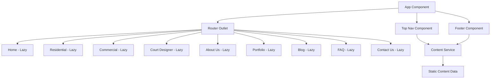

# Angular Website Structure Implementation

## Overview

This plan implements a complete website structure for a pickleball/tennis court construction company using Angular v21 with SSR. The implementation includes responsive navigation, footer, lazy-loaded routes, a static content service, and SEO optimization.

## Architecture



## Implementation Steps

### 1. Static Content Service

Create `src/app/services/content.service.ts` to centralize all static content including:

- Navigation menu items with dropdown structures
- Footer content (address, contact info, links)
- Company information
- All text content for easy maintenance

### 2. Top Navigation Component

Create `src/app/components/top-nav/top-nav.component.ts` with:

- Dual logo display (wbpbc-logo.webp and wbtc-logo.png side by side)
- Responsive menu with hamburger icon for mobile
- Dropdown menus for Residential and Commercial (hover on desktop, click on mobile)
- Menu items: Home, Residential (dropdown), Commercial (dropdown), Court Designer, About Us, Portfolio, Blog, FAQ, Contact Us
- Mobile-friendly navigation with slide-out or collapsible menu
- Active route highlighting

### 3. Footer Component

Create `src/app/components/footer/footer.component.ts` with:

- Dual logos at the top
- Company tagline and contact information
- Three-column layout: Residential links, Commercial links, Company links
- Social media links (Facebook, Instagram)
- Dynamic copyright year
- Responsive design (stacks on mobile)

### 4. Update App Component

Modify `src/app/app.ts` and `src/app/app.html` to:

- Include top-nav and footer components
- Wrap router-outlet in a main content area
- Remove placeholder content
- Ensure proper layout structure

### 5. Lazy-Loaded Routes

Update `src/app/app.routes.ts` to include lazy-loaded routes for:

- `/` - Home
- `/residential` - Residential (with child routes for sub-pages):
  - `/residential/pickleball-courts-construction`
  - `/residential/multi-sport-construction`
  - `/residential/basketball-courts`
  - `/residential/artificial-turf-putting-greens`
  - `/residential/court-fencing`
  - `/residential/hoops-nets`
  - `/residential/custom-courts`
  - `/residential/pickleball-court-resurfacing`
- `/commercial` - Commercial (with child routes for sub-pages):
  - `/commercial/indoor-pickleball-court`
  - `/commercial/tennis-court-resurfacing`
  - `/commercial/court-fencing`
  - `/commercial/court-resurfacing`
  - `/commercial/adding-pickleball-lines`
  - `/commercial/tennis-court-construction`
- `/court-designer` - Court Designer
- `/about-us` - About Us
- `/portfolio` - Portfolio
- `/blog` - Blog
- `/faq` - FAQ
- `/contact-us` - Contact Us

Each route will load its component lazily using `loadComponent` or `loadChildren`.

### 6. Page Components

Create placeholder page components for each route:

**Main Pages:**

- `src/app/pages/home/home.component.ts`
- `src/app/pages/court-designer/court-designer.component.ts`
- `src/app/pages/about-us/about-us.component.ts`
- `src/app/pages/portfolio/portfolio.component.ts`
- `src/app/pages/blog/blog.component.ts`
- `src/app/pages/faq/faq.component.ts`
- `src/app/pages/contact-us/contact-us.component.ts`

**Residential Pages:**

- `src/app/pages/residential/residential.component.ts` (parent with router-outlet)
- `src/app/pages/residential/pickleball-courts-construction/pickleball-courts-construction.component.ts`
- `src/app/pages/residential/multi-sport-construction/multi-sport-construction.component.ts`
- `src/app/pages/residential/basketball-courts/basketball-courts.component.ts`
- `src/app/pages/residential/artificial-turf-putting-greens/artificial-turf-putting-greens.component.ts`
- `src/app/pages/residential/court-fencing/court-fencing.component.ts`
- `src/app/pages/residential/hoops-nets/hoops-nets.component.ts`
- `src/app/pages/residential/custom-courts/custom-courts.component.ts`
- `src/app/pages/residential/pickleball-court-resurfacing/pickleball-court-resurfacing.component.ts`

**Commercial Pages:**

- `src/app/pages/commercial/commercial.component.ts` (parent with router-outlet)
- `src/app/pages/commercial/indoor-pickleball-court/indoor-pickleball-court.component.ts`
- `src/app/pages/commercial/tennis-court-resurfacing/tennis-court-resurfacing.component.ts`
- `src/app/pages/commercial/court-fencing/court-fencing.component.ts`
- `src/app/pages/commercial/court-resurfacing/court-resurfacing.component.ts`
- `src/app/pages/commercial/adding-pickleball-lines/adding-pickleball-lines.component.ts`
- `src/app/pages/commercial/tennis-court-construction/tennis-court-construction.component.ts`

Each component will have a basic structure ready for content implementation later.

### 7. SEO Configuration

- Update `src/index.html` with proper meta tags, Open Graph tags, and structured data
- Create `src/app/services/seo.service.ts` for dynamic meta tag management
- Add title service integration in app config
- Implement proper semantic HTML structure

### 8. Styling Variables

Create `src/styles/variables.scss` with:

- Color palette (primary, secondary, accent colors, text colors, background colors)
- Font families and font sizes
- Spacing variables (margins, paddings)
- Breakpoints for responsive design
- Transition timings and easing functions
- Border radius values
- Z-index scale

Import this file in `src/styles.scss` for global access.

### 9. Component Styling

- Create responsive SCSS styles for top-nav and footer
- Implement mobile-first responsive design using variables from variables.scss
- Add smooth transitions and hover effects
- Ensure proper spacing and typography
- Create shared styles for consistency

## File Structure

```
src/
├── styles/
│   ├── variables.scss
│   └── styles.scss
├── app/
│   ├── components/
│   │   ├── top-nav/
│   │   │   ├── top-nav.component.ts
│   │   │   ├── top-nav.component.html
│   │   │   └── top-nav.component.scss
│   │   └── footer/
│   │       ├── footer.component.ts
│   │       ├── footer.component.html
│   │       └── footer.component.scss
│   ├── pages/
│   │   ├── home/
│   │   ├── residential/
│   │   │   ├── residential.component.ts
│   │   │   ├── pickleball-courts-construction/
│   │   │   ├── multi-sport-construction/
│   │   │   ├── basketball-courts/
│   │   │   ├── artificial-turf-putting-greens/
│   │   │   ├── court-fencing/
│   │   │   ├── hoops-nets/
│   │   │   ├── custom-courts/
│   │   │   └── pickleball-court-resurfacing/
│   │   ├── commercial/
│   │   │   ├── commercial.component.ts
│   │   │   ├── indoor-pickleball-court/
│   │   │   ├── tennis-court-resurfacing/
│   │   │   ├── court-fencing/
│   │   │   ├── court-resurfacing/
│   │   │   ├── adding-pickleball-lines/
│   │   │   └── tennis-court-construction/
│   │   ├── court-designer/
│   │   ├── about-us/
│   │   ├── portfolio/
│   │   ├── blog/
│   │   ├── faq/
│   │   └── contact-us/
│   ├── services/
│   │   ├── content.service.ts
│   │   └── seo.service.ts
│   ├── app.ts
│   ├── app.html
│   ├── app.scss
│   └── app.routes.ts
```

## Key Features

1. **Responsive Design**: Mobile-first approach with breakpoints for tablet and desktop
2. **Accessibility**: Proper ARIA labels, semantic HTML, keyboard navigation
3. **Performance**: Lazy loading for all routes, optimized images
4. **SEO**: Meta tags, structured data, proper heading hierarchy
5. **Maintainability**: Centralized content service for easy updates
6. **User Experience**: Smooth transitions, clear navigation, mobile-friendly interactions